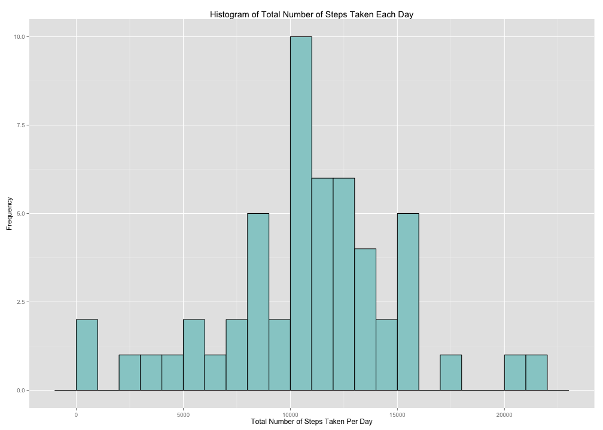
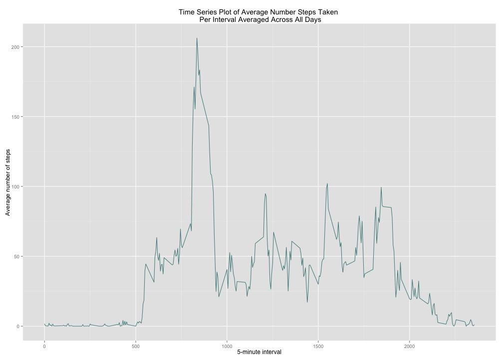
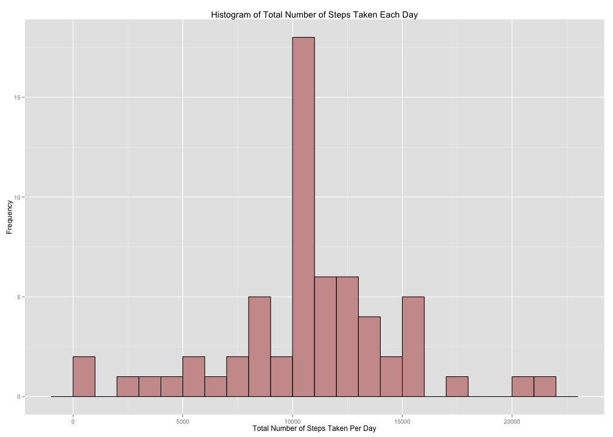
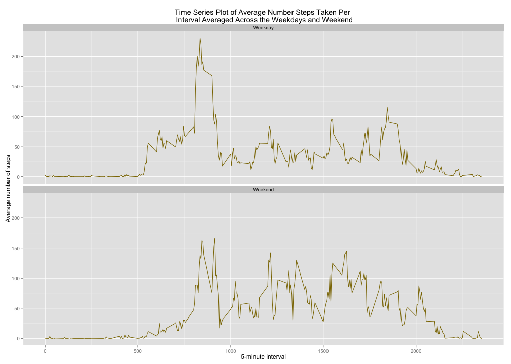

## Preliminary steps
#### 1. Setting global options to ensure default code visibility

```r
opts_chunk$set(echo=TRUE, fig.path='figure/', warning=FALSE, message=FALSE, fig.height=10, fig.width=14)
```
#### 2. Loading required packages

```r
library(ggplot2)
suppressPackageStartupMessages(library(dplyr))
library(timeDate)
library(knitr)
```

## Loading and preprocessing the data
#### 1. Load the data (i.e. read.csv() )

```r
# unzip the dataset file
unzip("activity.zip")
# read in the data
raw <- read.csv("./activity.csv")
```

#### 2. Process/transform the data (if necessary) into a format suitable for your analysis

```r
# remove all rows that contain missing (NA) values from the dataset
data <- na.omit(raw)
```

## What is mean total number of steps taken per day?
#### 1. Calculate the total number of steps taken per day

```r
# calculate the sum of the steps variable for each day
activityperday <- data %>% group_by(date) %>% summarise(stepsperday = sum(steps))
```

#### 2. If you do not understand the difference between a histogram and a barplot, research the difference between them. Make a histogram of the total number of steps taken each day

```r
# create a histogram with ggplot and customize color, bin width, and labels
ggplot(data = activityperday, aes(x = stepsperday)) + geom_histogram(colour = "black", fill = "paleturquoise3", binwidth = 1000) + labs(title = "Histogram of Total Number of Steps Taken Each Day", x = "Total Number of Steps Taken Per Day", y = "Frequency")
```

 

#### 3. Calculate and report the mean and median of the total number of steps taken per day

```r
# calculate and report the mean of the total number of steps taken per day
mean <- mean(activityperday$stepsperday)
mean
```

```
## [1] 10766.19
```


```r
# calculate and report the median of the total number of steps taken per day
median <- median(activityperday$stepsperday)
median
```

```
## [1] 10765
```
The mean total number of steps taken per day is 10766.19. The median total number of steps taken per day is 10765. 

## What is the average daily activity pattern?
#### 1. Make a time series plot (i.e. type = "l" ) of the 5-minute interval (x-axis) and the average number of steps taken, averaged across all days (y-axis)

```r
# calculate the mean of the steps variable for each interval
avgdap <- data %>% group_by(interval) %>% summarise(avgsteps = mean(steps))
# create a time series plot with ggplot and customize color and labels
ggplot(data = avgdap, aes(x = interval, y = avgsteps)) + geom_line(colour = "darkslategray4") + labs(title = "Time Series Plot of Average Number Steps Taken \n Per Interval Averaged Across All Days", x = "5-minute interval", y = "Average number of steps")
```

 

#### 2. Which 5-minute interval, on average across all the days in the dataset, contains the maximum number of steps?

```r
# subset the data to find the maximum mean steps in the average daily activity pattern and it's corresponding interval
avgdap[avgdap$avgsteps == max(avgdap$avgsteps),]
```

```
## Source: local data frame [1 x 2]
## 
##   interval avgsteps
## 1      835 206.1698
```
Interval 835 has the maximum number of steps. 

## Imputing missing values
#### 1. Calculate and report the total number of missing values in the dataset (i.e. the total number of rows with NA s)

```r
# take sum of the rows with NA s to calculate total missing values
missingvalues <-sum(is.na(raw))
missingvalues
```

```
## [1] 2304
```
The total number of missing values in the dataset is 2304. 

#### 2. Devise a strategy for filling in all of the missing values in the dataset. The strategy does not need to be sophisticated. For example, you could use the mean/median for that day, or the mean for that 5- minute interval, etc.  
On the days where the dataset is missing data, the mean daily interval value will replace the NA values.

#### 3. Create a new dataset that is equal to the original dataset but with the missing data filled in.

```r
# create imputation function that replaces the NAs with the mean value
imputation <- function(i) {replace(i, is.na(i), mean(i, na.rm = TRUE))}
# apply the imputation function to the steps variable for each interval
imputed <- raw %>% group_by(interval) %>% mutate(steps = imputation(steps))
# calculate the sum of the steps variable for each day
imputeddap <- imputed %>% group_by(date) %>% summarise(sum = sum(steps))
```

#### 4. Make a histogram of the total number of steps taken each day and Calculate and report the mean and median total number of steps taken per day. 

```r
# create a histogram with ggplot and customize color, bin width, and labels
ggplot(data = imputeddap, aes(x = sum)) + geom_histogram(colour = "black", fill = "rosybrown3", binwidth = 1000) + labs(title = "Histogram of Total Number of Steps Taken Each Day", x = "Total Number of Steps Taken Per Day", y = "Frequency")
```

 

```r
# calculate the mean total number of steps per day
impmean <- mean(imputeddap$sum)
impmean
```

```
## [1] 10766.19
```

```r
# calculate the median total number of steps per day
impmedian <- median(imputeddap$sum)
impmedian
```

```
## [1] 10766.19
```
The mean total number of steps taken per day is 10766.19. The median total number of steps taken per day is 10766.19. 

#### Do these values differ from the estimates from the first part of the assignment?  What is the impact of imputing missing data on the estimates of the total daily number of steps?

Method | Mean | Median
 ------------- | ------------- | -------------
 Removing missing values    | 10766.19       | 10765
 Imputing missing values        | 10766.19        | 10766.19
 
The mean remained the same when the missing values were replaced with the imputations. The median derived from imputing the missing values increased by 1.19. The lack of change in the mean and less than 2 step increase in the median indicate that imputing the missing data had little impact on the estimates of the total daily number of steps. 

## Are there differences in activity patterns between weekdays and weekends?
#### 1. Create a new factor variable in the dataset with two levels – “weekday” and “weekend” indicating whether a given date is a weekday or weekend day.

```r
# use timeDate's isWeekend() to determine if each date is a weekday or weekend-day and add another column called dow comprised of those values which are labeled as Weekend and Weekday instead of true and false
imputed$dow <- factor(isWeekend(imputed$date, wday = 1:5), labels = c("Weekday", "Weekend"))
# calculate the mean number of steps averaged across all weekdays or weekend-days per interval
weekendweekday <- imputed %>% group_by(interval, dow) %>% summarise(mean=mean(steps))
```

#### 2. Make a panel plot containing a time series plot (i.e. type = "l" ) of the 5-minute interval (x-axis) and the average number of steps taken, averaged across all weekday days or weekend days (y-axis). See the README file in the GitHub repository to see an example of what this plot should look like using simulated data.

```r
# create a time series plot with ggplot and customize color and labels
ggplot(data = weekendweekday, aes(x = interval, y = mean)) + geom_line(colour = "gold4") + labs(title = "Time Series Plot of Average Number Steps Taken Per \n Interval Averaged Across the Weekdays and Weekend", x = "5-minute interval", y = "Average number of steps") + facet_wrap(~dow, nrow=2)
```

 

Yes, the pattern differs between the weekdays and the weekend, with the weekends showing less steps earlier and higher average number of steps throughout in comparison to the weekdays.


```r
# Remove packages
detach(package: ggplot2, unload = TRUE)
detach(package: dplyr, unload = TRUE)
detach(package: timeDate, unload = TRUE)
detach(package: knitr, unload = TRUE)
```
